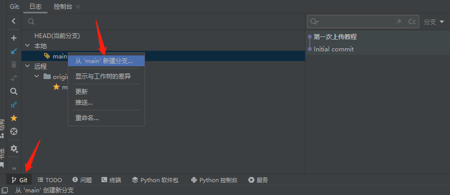

# 一、为什么使用Git

版本控制软件就是为了对软件进行版本控制而开发的工具软件。目前常用的版本控制软件有协作版本系统(CVS)，Subversion(SVN)，git等。

git相比于SVN具有明显的优势，主要是因为它是一个分布式管理系统。这意味着每个开发者的计算机上都有一个完整的仓库，包括完整的源代码以及开发历史。每个开发者需要在自己的仓库内完成自己的工作，形成稳定版本后再上传至远程服务器。这大大减少了开发者之间的冲突，并且对网络的依赖也不如SVN那样严重。

# 二、Git的安装

1. 在[此链接](https://git-scm.com/downloads)下载windows版本的安装程序。

1. 运行安装程序进行安装，相关设置如下图。这里选择安装git的命令行界面和GUI界面。

1. 选择此项意味着可以在Windows的命令行cmd.exe中运行git命令。

1. Windows中的文本文件格式和Linux/Unix中的文本文件格式[有所区别](http://blog.csdn.net/lucky_greenegg/article/details/43232211),此选项可以使得git自动进行格式转换。

1. 使用MinTTY打开Git Bash。这是一个支持多字符集、支持256位色、支持鼠标右键菜单的强大终端。

1. 安装完成后，在资源管理器中点击鼠标右键，会出现*Git GUI Here*和*Git Bash Here*的选项。

# 三、 Gitlab的使用

登陆自己的账号后，会看到如下页面，页面的中间显示了现在正在参与的项目，包括自己创建的项目和小组中共同开发的项目。

## 连接gitlab远程仓库

### 在gitlab创建项目，并选择clone方式，目前仅能使用SSH方式：

方式一：是通过SSH方式连接，需要SSH的账号和密码；

~~方式二：是通过HTTPS方式连接，直接获取~~ 

### SSH连接

SSH（Secure Shell，安全外壳协议）提供了*点对点*的安全通讯方式。它识别的是设备信息而不是账户信息，你可以向你的账号中添加一台设备（通过添加SSH公钥）来将此设备设定为“可信赖”。之后使用此设备与远程仓库交互时，GitLab会根据你当前使用的设备来验证你的身份。

首先需要在自己的设备上生成SSH公钥。Windows系统的SSH公钥保存在用户主目录的.ssh下（如`C:\Users\85176\.ssh`），若有`id_rsa.pub`文件，说明公钥已生成。若无此文件，则需要生成。

若没有公钥，可以使用`ssh-keygen -t rsa -C "[你的邮箱]"`命令生成公钥。

生成过程中不需要设置密码。生成后使用文本工具打开`id_rsa.pub`文件，可以看到公钥的内容如下图所示。

登陆GitLab账户后，在右上角进入*编辑个人资料-SSH密钥* 中添加SSH公钥。只需要将*id_rsa.pub*的内容复制在文本框中，再输入一个名字，点击*Add Key*即可添加。如下图所示。

### 创建项目上传自己的代码

直接选择创建空白项目

输入项目名称即可

默认只有一个Readme.md文件，我们先将项目克隆到本地

在此处输入地址和目录即可将空项目克隆到本地

把你的项目文件复制到目录下，会自动提示你是否加入Git

文件名称变绿则代表已经加入版本控制但未提交更改

在pycharm右上角选择拉取（Pull）、提交（Commit）、推送（Push）

推送(push):把您本地仓库的代码推送至服务器，将本地库中的最新信息发送给远程库。

提交(commit):把您做的修改,保存到本地仓库中，将本地修改过的文件提交到本地库中。

git commit操作的是本地库，git push操作的是远程库。

先选择提交（Commit），选择需要提交的文件，输入提交说明

名称变白则说明文件已经提交完成

点击推送即可将本地提交的文件推送至服务器端

Gitlab显示了刚刚提交的更改

# 分支

git版本库存储了所有的历史版本和修改的记录，其存储结构可以理解成一个“树”状的图（并不等同于离散数学中的“树“），一个典型的版本结构如下图所示。

图中每个结点均代表了一个版本号。可以看到，我们初始只有主分支（master）上的第一个版本，然后由此版本引出了branchA分支。自此主分支和branchA分支平行前进，互不干扰。主分支在分出branchA分支后，还可以继续分出branchB分支，只不过branchB分支的开始版本与主分支的第二个版本相同。branchA分支依然可以继续分出branchC分支，这些分支依然是平行前进互不干扰的。分支还可以进行合并，如branchA分支的最后并入了主分支，合成了一个新的版本。在分支合并时，主分支上的版本很可能不再是branchA分支分出时的版本，当前版本很可能与branchA分支的当前版本相冲突，这时就需要开发人员解决冲突，git也为我们提供了相关的工具。分支的合并实际上是在两个分支上都进行了一次提交，使得两个分支上的版本相同，而不一定要消灭掉某个子分支。比如branchB与主分支合并后，branchB并没有被删除，而是继续开发。
我们创建一个分支test，用于修改代码，当确认代码没问题再将其合并到主分支main

我们将文件名更改进行提交

此处可以看到推送的分支名称为test

Gitlab上可看到出现了test分支

这样就可以在保证主分支不被修改的情况下进行代码开发，当代码出现问题时，可回滚到主分支，若开发没问题，可创建合并请求，将代码合并到主分支。

# 议题（issue）

issue是小组合作交互的灵魂所在。开发者可以在GitLab上创建issue来讨论问题，明确下一步要做的事以及指派人去完成。受到指派的人会收到通知。与任务无关的人可以在issues页面中进行相关讨论，issues可以随时关闭、指派新的任务或者更换任务执行人。
点击*Issues→New Issue*即可创建专案，如下图。

在issue创建界面可以输入issue的题目、详细描述、分配给任务的人。issue的题目力求简洁精炼。描述部分支持[Markdown](http://sspai.com/25137)语法，可以呈现出漂亮的排版效果。创建好issue后，点击即可进入issue界面，如下图。

待办事项出现Issue

Issue界面就像一个论坛，组内成员可以自由发表意见，当一个Issue被完成后可将其关闭，可用于创建待办事项提醒自己

